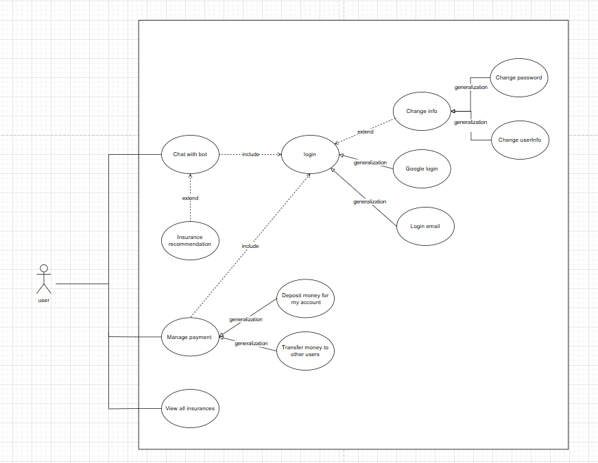
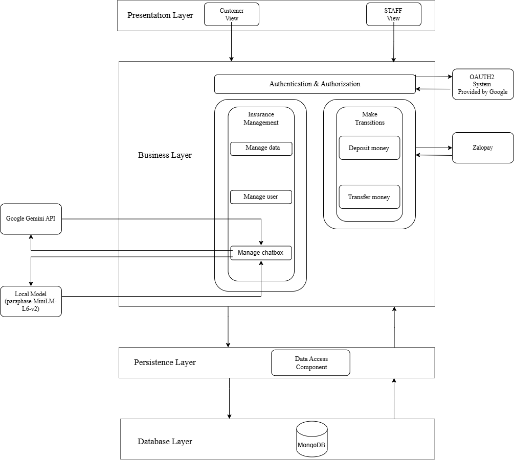
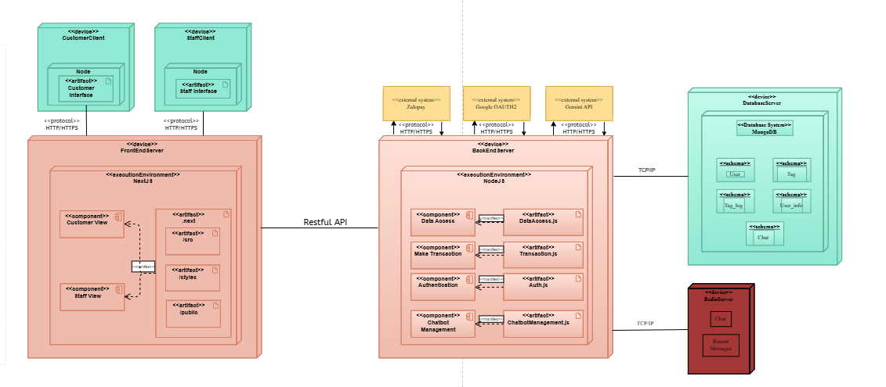
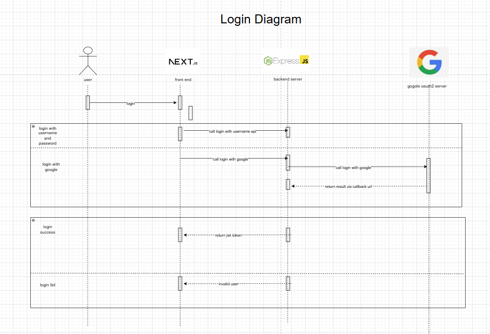
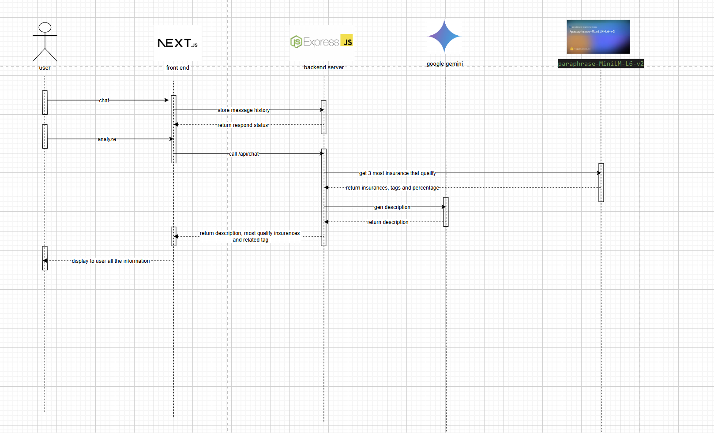

# 🛡️ AI Chatbot & CRM Tagging for Insurance

## 📌 Overview

This project is an **AI assistant platform for both end-users and internal teams** at a local insurance company.

- For **customers**, it acts as a **conversational recommendation assistant**, helping them find the most suitable VHIS insurance plans based on personal needs.
- For **internal marketing teams**, it builds a **CRM tagging pipeline** to classify user intents and enable behavioral analytics for future campaign retargeting.

The chatbot leverages both **Google Gemini** for natural conversation and **a custom-trained local semantic similarity model** to ensure personalized and relevant plan suggestions.

---

## ✅ Core Features

### 1. 🔍 AI Chatbot (Main Feature)

- Conversational interface to assist users in exploring VHIS insurance plans.
- Gemini API integration (Google Generative Language) for natural replies.
- Prompting logic trained with insurance plan metadata.
- Semantic model to match user queries to most relevant plans.

### 2. 🏷️ CRM Tagging Pipeline (Main Feature)

- Uses internal semantic model to extract top matching tags.
- Tracks frequency of tag usage per user.
- Logs into MongoDB (`TagLog`) to build CRM profiles.
- Top tag is inferred and matched against `insurance.json` to enrich CRM.

### 3. 🔐 Authentication (Optional Feature)

- Google Sign-in / Email login with session handling.

### 4. 💳 Insurance Browsing & Payment (Optional Feature)

- Intergrated with Zalopay. 
- View insurance package details.
- Simulate deposit / transfer operations.

---

## 🎯 Target Audience

- Consumers looking for insurance products that match their personal needs.
- Non-technical users who may require assistance from an AI-powered chatbot.
- Customer advisors leveraging the system to recommend insurance plans and analyze customer behavior via the CRM. 

### 📷 Use case Diagram

Below are some visual examples to better understand the use case and flow of the tool:

**Chatbot Interface**  
  


## 🏗️ Architecture

- **Frontend**: React (ShadCN UI + TailwindCSS).
- **Backend**: Node.js + Express + MongoDB.
- **AI Services**:
  - Google Gemini API.
  - Local Semantic Search Model (MODEL: paraphrase-MiniLM-L6-v2).

**Architecture Diagram**
  

**Deployment Diagram**  
  
---

## 📂 Folder Structure

```
├── model
│   ├── chatModel.ts        # MongoDB schema for conversation history
│   ├── tagLog.ts           # Logs tag frequencies and top tag for CRM
├── service
│   ├── chatService.ts      # Main logic combining Gemini + tag + DB
│   ├── geminiService.ts    # Clean Gemini API abstraction
│   ├── boxChatService.ts   # Calls to semantic tag model
├── data
│   └── insurance.json      # Raw plan data with name, type, features
```

---

## 🔍 Implementation Walkthrough

### 🧪 Step 1: Semantic Matching with Local Model

```ts
const response = await axios.post('http://localhost:8000/sendMsg', {
  text: userInput
});
const tags = response.data?.[0] || [];
const ids = response.data?.[1] || [];
```

- ✅ **Purpose**: Extract semantically relevant insurance products from corpus.
- ✅ **Output**: 
  - A list of plan names (`tags`) with similarity scores.
  - A list of product metadata (`ids`) to map recommended plans by index.

---

### 🧠 Step 2: Gemini Prompting Flow

```ts
const prompt = buildPrompt(userInput, tags);
// Includes top tag-based plan names
// Ensures only natural language returned
```

- 🎯 Injects user query + tag-based suggestions.
- 🔒 Restricts output to natural language, avoiding JSON/Markdown for better UX.

---

### 🧾 Step 3: CRM Tag Logging Logic

```ts
await TagLog.create({
  name: // name of insurance,
  type: // ex: "Flexi Premium",
  targetAudience: [ "VIP clients", "pre-existing conditions" ],
  features: [ "Private room", "Full hospital expense coverage" ]
});
```

- 📦 Stores most relevant tag per session for long-term trend tracking.
- 📊 Enables analysis for future segmentation and retargeting.

---

## Here are the flow user interact with our system: 
-   
Login pipeline

--- 

-   
Payment pipeline

---

-   
AI pipeline

---

### 🔬 Evaluation

## ✅ What Worked

Gemini responds fluently with contextual coherence.

Combining Gemini + tag-based similarity produces more relevant suggestions.

CRM pipeline lets consultants understand repeated interests.

## ⚠️ Challenges

Local similarity model was too naive on surface-level keywords.

Data like "premium" or "children" were matched incorrectly.

Confidence score did not correlate well with intent.

## 💡 Lessons & Recommendations

⚡️ Need real customer Q&A for training.

✨ Add product descriptions (semantic-rich) to improve embedding.

♻️ Use Gemini to rerank or reason instead of relying fully on vector score.

## ☑️ Next Improvements

Integrate usage analytics

Add customer intent classification

Explore fine-tuned Gemini on internal corpus

## 💰 Cost & Feasibility

### Deployment

- **Local hosting** (192.168.4.154) for semantic model → Low infra cost.
- **Gemini API** (Free tier or billing depending on usage).

### Scaling Strategy

- Add Redis for caching recent tag queries.
- Migrate to cloud DB if internal use scales beyond expected.

---

## 👥 Team Members

| Role               | Name             | Responsibilities                                                                 |
|--------------------|------------------|----------------------------------------------------------------------------------|
| 🧠 **AI Developer** | **Tran Minh Khang** | - Prompt engineering<br>- Gemini API integration<br>- Semantic similarity model |
| 🎨 **Frontend Developer** | **Ly Vinh Thai**   | - Chat UI/UX<br>- Insurance plan viewer<br>- CRM tag visualization              |
| 🛠️ **Backend Developer** | **Le Hoang Viet**   | - RESTful API & routing<br>- MongoDB schema design<br>- Pipeline coordination    |

---

**End of README**

